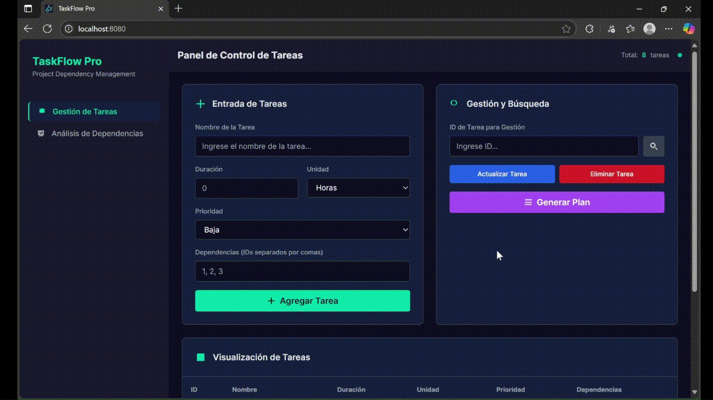
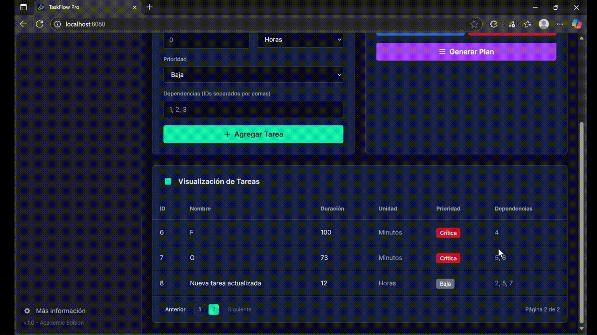

# Proyecto de Matemáticas Discretas I
<br>

<br>
UNIVERSIDAD NACIONAL DE COLOMBIA 
<br>
Matemáticas Discretas I 
<br>
2025963 – Grupo 2
<br><br>
Autores: 

- Samuel Ándres Herrera Villero (saherrerav@unal.edu.co) 
- Nicolás Aguirre Velásquez (niaguirrev@unal.edu.co) 
- Ever Nicolás Muñoz Cortés (evmunoz@unal.edu.co)
- Juan David Amado Rubio (juamador@unal.edu.co) 

Docente: Arles Ernesto Rodríguez Portela
<br><br>

---

## Contenido

- [1. Objetivos](#1-objetivos)
  - [1.1 Objetivo General](#11-objetivo-general)
  - [1.2 Objetivos Específicos](#12-objetivos-especificos)
- [2. Principios de Matemáticas Discretas](#2-principios-de-matematicas-discretas)
- [3. Estructura del Proyecto](#3-estructura-del-proyecto)
- [4. Requisitos de Instalación](#4-requisitos-de-instalación)
- [5. Ejecución Local](#5-ejecución-local)
- [6. Instrucciones de Uso](#6-instrucciones-de-uso)
- [7. Ejemplod de Uso](#7-ejemplos-de-uso)
   - [7.1 Grafo sin Dependencias Cíclicas](#71-grafo-sin-dependencias-cíclicas)
   - [7.2 Grafo con Dependencias Cíclicas](#72-grafo-con-dependencias-cíclicas) 
- [8. Tecnologías Utilizadas](#8-tecnologías-utilizadas)
- [9. Conclusiones](#9-conclusiones)
- [10. Referencias](#10-referencias)

<br><br>

---

## 1. Objetivos

### 1.1 Objetivo General

Desarrollar un sistema para optimizar la planificación de tareas que, a partir de una lista de tareas, sus prioridades y sus dependencias, modele estas relaciones usando un grafo dirigido. El sistema deberá generar planes de ejecución válidos, detectar dependencias circulares que impidan una planificación coherente, y calcular la duración total del proyecto.

### 1.2 Objetivos Especificos

- Implementar un algoritmo DFS (búsqueda en profundidad) para la detección de dependencias circulares.

- Diseñar una interfaz gráfica para la interacción con el sistema.

- Aplicar principios de matemáticas discretas y propiedades de grafos para la identificación efectiva de dependencias cíclicas en la planificación de tareas.
<br><br>

---

## 2. Principios de Matematicas Discretas

- **Relaciones y sus propiedades (Ej. transitividad)**:
- **Relaciones de orden**:
- **Funciones (para asignar duraciones a tareas)**:
- **Complejidad de algoritmos**:
- **Grafos dirigidos**:
<br><br>

---

## 3. Estructura del Proyecto
``` txt
C:.
│   .npmrc                     # Configuración de npm
│   .prettierrc                # Configuración de Prettier
│   AGENTS.md                  # Info sobre agentes
│   components.json            # Configuración de componentes UI
│   index.html                 # Punto de entrada HTML
│   package-lock.json          # Versiones exactas de dependencias npm
│   package.json               # Metadatos del proyecto y dependencias
│   postcss.config.js          # Configuración de PostCSS
│   tailwind.config.ts         # Configuración de Tailwind CSS
│   tsconfig.json              # Configuración de TypeScript
│   vite.config.server.ts      # Configuración del servidor de desarrollo Vite
│   vite.config.ts             # Configuración de Vite
│
├───client                     # Frontend React
│   │   App.tsx                # Componente principal y rutas
│   │   global.css             # Estilos globales y Tailwind
│   │   vite-env.d.ts          # Tipos para variables de entorno de Vite
│   │
│   ├───components             # Componentes React reutilizables
│   │   │   Layout.tsx         # Diseño común de las páginas
│   │   │   MobileNav.tsx      # Navegación móvil
│   │   │   Sidebar.tsx        # Barra lateral de navegación
│   │   │
│   │   └───ui                 # Componentes de interfaz de usuario (Radix UI)
│   │           accordion.tsx
│   │           alert-dialog.tsx
│   │           alert.tsx
│   │           aspect-ratio.tsx
│   │           avatar.tsx
│   │           badge.tsx
│   │           breadcrumb.tsx
│   │           ...
│   │
│   ├───hooks                  # Hooks de React personalizados
│   │   use-mobile.tsx         # Detecta si es dispositivo móvil
│   │   use-toast.ts           # Muestra mensajes de notificación
│   │
│   ├───lib                    # Funciones de utilidad
│   │   utils.ts               # Funciones de utilidad general
│   │   utils.spec.ts          # Pruebas unitarias para utils.ts
│   │
│   └───pages                        # Componentes de las páginas
│       CriticalPathAnalysis.tsx     # Análisis de ruta del proyecto
│       Index.tsx                    # Página de inicio
│       NotFound.tsx                 # Página de error 404
│       TaskManagement.tsx           # Gestión de tareas
│
├───public                     # Archivos estáticos
│   favicon.png                # Icono del navegador
│   placeholder.svg            # Imagen de marcador de posición
│   robots.txt                 # Instrucciones para rastreadores web
│
├───server                     # Backend Express
│   │   index.ts               # Punto de entrada del servidor
│   │   node-build.ts          # Configuración del proyecto Node
│   │
│   ├───backend                      # Lógica del backend (Python)
│   │   │   api.py                   # API con FastAPI
│   │   │   dependency_analyzer.py   # Analiza dependencias y ciclos
│   │   │   graph_builder.py         # Construye el grafo de dependencias
│   │   │   requirements.txt         # Dependencias de Python
│   │   │   task.py                  # Define la clase Task
│   │   │   ___init__.py             # Marca el directorio como módulo de Python
│   │   │
│   │   └───__pycache__        # Cache de Python
│   │
│   └───routes                 # Rutas de la API (Node)
│       demo.ts                # Ruta de demostración
│
└───shared                     # Código compartido
    api.ts                     # Interfaces de datos (TypeScript)
```
<br><br>

---

## 4. Requisitos de Instalación

#### Requisitos Generales:
- Git (2.25 o superior): Git es un sistema de control de versiones que se utiliza para gestionar el código del proyecto. Puedes descargarlo e instalarlo desde este enlace: https://git-scm.com/downloads.

- Node.js (18 o superior): Node.js es un entorno de ejecución de JavaScript que se utiliza para ejecutar el frontend (interfaz de usuario) del proyecto. Puedes descargarlo e instalarlo desde este enlace: https://nodejs.org/en/download/.
Durante la instalación, asegúrate de que la opción "Add to PATH" esté seleccionada. Esto permitirá que puedas ejecutar comandos de Node.js desde la terminal.

- Python (3.11 o superior): Python es un lenguaje de programación que se utiliza para ejecutar el backend (servidor) del proyecto. Puedes descargarlo e instalarlo desde este enlace: https://www.python.org/downloads/.
Durante la instalación, asegúrate de que la opción "Add Python to PATH" esté seleccionada. Esto permitirá que puedas ejecutar comandos de Python desde la terminal.
<br><br>

#### Descargar el Código del Proyecto desde GitHub:
- Abre la línea de comandos (o terminal) y navega al directorio donde quieres guardar el proyecto. 

- Utiliza el siguiente comando con la URL real del repositorio de GitHub:
``` bash
git clone https://github.com/nicolasmcort/Proyecto_Matematicas_Discretas_I.git
```
Esto descargará el código del proyecto a una nueva carpeta con el mismo nombre que el repositorio.
<br><br>

#### Frontend:
- Abre una terminal en el directorio `/client` y ejecuta el siguiente comando:
``` bash
npm install
```
Esto instalará todas las dependencias del frontend especificadas en el archivo `package.json`.
<br><br>

#### Backend:
- Crea un entorno virtual para aislar las dependencias del backend. Puedes utilizar `venv` o `virtualenv`.
``` bash
python3 -m venv venv  # Crea el entorno virtual
venv\Scripts\activate  # Activa el entorno virtual (Windows)
```
Es recomendable utilizar un entorno virtual para evitar conflictos con otras versiones de paquetes instaladas en tu sistema.

- Abre una terminal en el directorio `server/backend` y ejecuta el siguiente comando:
``` bash
pip install -r requirements.txt
```
Esto instalará todas las dependencias del backend especificadas en el archivo `requirements.txt`.
<br><br>

---

## 5. Ejecución Local

#### Backend:
- Abre una terminal en el directorio `server/backend` y ejecuta el siguiente comando:
``` bash
uvicorn api:app 
```
Uvicorn iniciará el servidor y este permanecerá en funcionamiento hasta que lo detengas manualmente (por ejemplo, con `Ctrl+C` en la terminal). 
<br><br>

#### Frontend:
- Abre otra terminal diferente, navega al directorio `/client` y ejecuta el siguiente comando:
``` bash
npm run dev
```
Esto iniciará el servidor de desarrollo en el puerto 8080 (o algún otro puerto disponible). Podrás acceder a la aplicación en el navegador escribiendo la URL http://localhost:8080, o por medio de la combinación de teclas `o` + `enter` en la terminal.
<br><br>

#### Nota:
Asegúrate de que el backend se esté ejecutando antes de intentar acceder a la aplicación en el navegador.
<br><br>

---

## 6. Instrucciones de Uso

#### Panel de Control de Tareas:
En la página principal, utiliza el formulario para agregar nuevas tareas.

- Define el nombre, la duración, la unidad (Horas/Minutos), la prioridad (Baja, Media, Alta, Crítica) y las dependencias, que corresponden a los IDs de otras tareas de las que esta tarea depende para poder iniciarse, separados por comas.


<br>

- Desde la sección 'Gestión y Búsqueda', puedes ejercer control total sobre tus tareas individuales. Simplemente busca por ID para:

- Actualizar la información de una tarea existente.


<br>

- Eliminar una tarea.


<br><br>

#### Análisis de Dependencias:
Después de definir las tareas, haz clic en el botón "Generar Plan" en la página principal. Esto te redirigirá a la página de análisis, donde podrás ver:
- El grafo de dependencias visualizado.
- La duración total estimada del proyecto.
- El número de tareas críticas.
- La posible ruta del proyecto detectada, mostrando la secuencia de tareas.
- Si existen dependencias cíclicas, se mostrarán en una sección separada.
<br>


<br><br>

---

## 7. Ejemplos de Uso

### 7.1 Grafo sin Dependencias Cíclicas

  
| Tareas       | Dependende de|
|--------------|:------------:|
| A            | Ninguna      |
| B            | A            |
| C            | A            |
| D            | B            |
| E            | B, C         |
| F            | D            |
| G            | E, F         |
<br>


<br>


<br>

  
### 7.2 Grafo con Dependencias Cíclicas

- Tareas y Dependencias:
  
| Tareas       | Dependende de|
|--------------|:------------:|
| A            | G            |
| B            | A            |
| C            | A            |
| D            | B            |
| E            | B, C         |
| F            | D            |
| G            | E, F         |
<br>


<br>


<br><br>

---

## 8. Tecnologías Utilizadas

Principales tecnologías, frameworks y librerías utilizadas en el proyecto.

#### Backend
- Python
- FastAPI
- Uvicorn
- NetworkX
- Matplotlib

#### Frontend
- React
- Vite
- TypeScript
- Tailwind CSS
- React Router DOM
- Radix UI
- Lucide React icons

#### Otros
- Git
- VSCode
- npm
- pydantic
- jsdom
- cytoscape
- postcss
- Figma
- Builder.io
<br><br>

---

## 9. Conclusiones

- Se implementó satisfactoriamente un algoritmo de búsqueda en profundidad (DFS) que permite la detección robusta de dependencias circulares dentro del grafo de tareas, asegurando la validez de la planificación.

- Se diseñó y desarrolló una interfaz gráfica de usuario intuitiva que facilita la interacción con el sistema, permitiendo a los usuarios definir tareas y visualizar los resultados de la optimización de manera clara y accesible.

- Se aplicaron con éxito principios fundamentales de matemáticas discretas y propiedades inherentes de los grafos para la identificación efectiva de rutas de ejecución y dependencias cíclicas.
<br><br>

---

## 10. Referencias

// TODO


<br>


